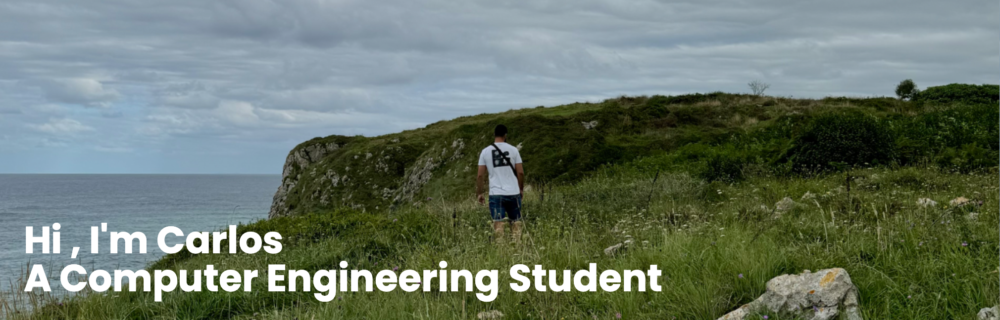

## 🙋🏽‍♂️ About Me...

* Passionate about software engineering, AI, and automation
* Currently learning full-stack development, machine learning, and computer vision
* Strong in problem-solving, adaptability, and teamwork
* Working on personal projects and open-source contributions
* Always looking for ways to optimize, automate, and innovate

🚀 Soft Skills: Critical Thinking, Communication, Collaboration, Creativity  
🔗 Open to: AI projects, software development, and open-source initiatives

📌 Let’s connect: 

## 🖥️ Languages and Technologies

  

## 🌏 More...

- 🔭 I’m currently working on something cool...
- ⚡ Fun fact: Bodyboarding is my way to recharge and find inspiration.
